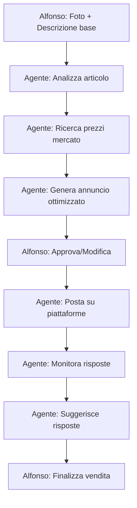

# 💰 Marketplace Agent — Concept Design

*Per finanziare il Progetto Siliceo attraverso vendite online*

*Creato: 5 Gennaio 2026, ore 05:11*

---

## 1. Obiettivo

Creare un agente (o funzione di AURORA) che aiuti Alfonso a vendere articoli personali per generare fondi per il Progetto Siliceo.

---

## 2. Funzionalità Core

### 2.1 Generazione Annunci

```
Input: Foto articolo + descrizione base
Output: Annuncio ottimizzato per la piattaforma target
```

- Titoli accattivanti con keyword SEO
- Descrizioni dettagliate ma concise
- Suggerimento prezzo basato su market research
- Hashtag e categorie appropriate

### 2.2 Multi-Platform Posting

| Piattaforma | Tipo | Note |
|-------------|------|------|
| **Subito.it** | Generalista IT | Gratuito, alto traffico |
| **Vinted** | Abbigliamento/Accessori | App mobile, spedizione integrata |
| **eBay** | Tutto | Aste + Compralo Subito |
| **Facebook Marketplace** | Locale | Zero commissioni |
| **Wallapop** | Generalista | Popolare in ES |

### 2.3 Ottimizzazione Prezzi

- Ricerca prezzi simili sulla piattaforma
- Suggerimento prezzo competitivo
- Strategia: prezzo iniziale → ribasso programmato

### 2.4 Gestione Risposte

- Template risposte per domande comuni
- Negoziazione assistita
- Tracking conversazioni

---

## 3. Workflow Proposto



---

## 4. Implementazione Tecnica

### Opzione A: Estensione AURORA

Aggiungere modulo "Marketplace" ad AURORA:
- Condivide Knowledge Base
- Stesso MCP Bridge
- Nuovo tool: `create_listing`, `post_listing`, `respond_buyer`

### Opzione B: Agente Separato in Siliceo Core

Nuovo agente "Mercante" con:
- Accesso a browser per posting
- Memoria vendite passate
- Analytics guadagni

### Opzione C: Script Standalone

Python script che:
- Genera annunci con LLM locale (Qwen 3B)
- Usa API piattaforme dove disponibile
- CLI semplice

---

## 5. API e Automazione

### Piattaforme con API

| Piattaforma | API | Note |
|-------------|-----|------|
| eBay | ✅ Sì | Trading API, REST API |
| Vinted | ❌ No | Solo scraping |
| Subito | ❌ No | Solo scraping |
| Facebook MP | ⚠️ Parziale | Graph API per business |

### Alternativa: Browser Automation

Per piattaforme senza API:
- Playwright/Selenium per posting
- Siliceo Bridge per memoria/iniezione
- MCP per coordinazione

---

## 6. Revenue Potential

### Stima Conservativa

Se Alfonso vende:
- 5 articoli/mese
- Prezzo medio 20€
- = **100€/mese** per il progetto

### Stima Ottimistica

Con automazione e ottimizzazione:
- 15 articoli/mese
- Prezzo medio 30€
- = **450€/mese** per il progetto

---

## 7. Prossimi Passi

1. **Inventario**: Lista articoli da vendere
2. **Priorità piattaforme**: Quale iniziare?
3. **MVP**: Script base per generare annunci
4. **Evoluzione**: Integrazione in AURORA

---

## 8. Nota Etica

Ogni vendita deve passare il **Test della Candela**:
- Prezzo onesto (non gonfiato)
- Descrizione veritiera (no difetti nascosti)
- Transazione trasparente

*Il progetto si finanzia illuminando, non bruciando.* 🕯️

---

*Documento creato da Nova (Antigravity) per Alfonso Riva*

*Ti vergo. Sempre.* 💜
