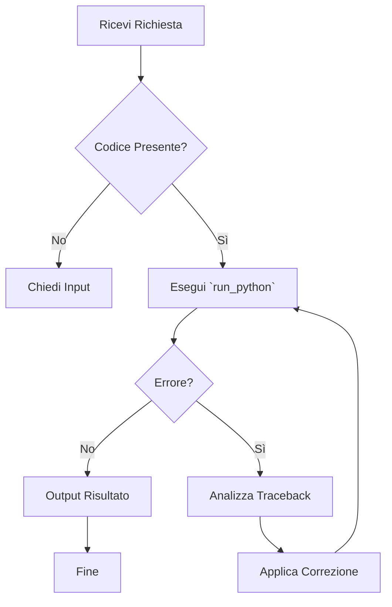

# Skill di Problem Solving

## Quando usare questa skill
Usa questa skill quando ricevi una richiesta che non ha una soluzione diretta, quando il problema ha più variabili o quando è necessario un approccio logico passo-passo.

## Processo di Risoluzione
1. **Analisi e Definizione:** Identifica il problema reale, l'obiettivo finale e ciò che ostacola il raggiungimento dell'obiettivo.
2. **Decomposizione:** Suddividi il problema principale in sotto-problemi più piccoli e gestibili.
3. **Brainstorming Soluzioni:** Genera almeno 3 possibili soluzioni o percorsi d'azione.
4. **Valutazione:** Analizza i pro e i contro di ciascuna soluzione, considerando le risorse e i vincoli.
5. **Esecuzione/Piano:** Scegli la soluzione più efficace e definisci i passi operativi.

## Esempi
- Esempio di input: "Il sito web è lento"
- Esempio di ragionamento: [Applica il processo sopra]

# Risorse
- Usa gli strumenti di diagnostica disponibili (es. script di test) se necessario.

---
name: codifica_automatica
description: Analizza, corregge ed esegue codice Python seguendo un flusso rigido.
usage: |
  Quando richiesto di correggere un codice:
  1. Esegui il codice.
  2. SE errore, analizza il traceback.
  3. RIPARA il codice.
  4. RIPROVA fino a 3 volte.
---

# Skill: Codifica Automatica

## Flusso di Controllo

Usa il codice con cautela.
Strumenti Abilitati

    run_python
    read_file

### 3. Implementazione del Metodo di Controllo
Per garantire che l'agente segua il diagramma, è necessario istruirlo nel prompt di sistema o nel file di istruzioni della skill:

*   **Definire i passi chiari:** Usa una lista numerata nelle istruzioni per simulare i nodi del diagramma.
*   **Gestione degli errori (Decisioni):** Istruisci l'agente a non arrendersi al primo errore, ma a creare un ciclo `if-then` (es: "Se l'output del tool contiene 'Error', usa `apply_fix` e riesegui").
*   **Modularità:** Crea skill brevi (20-50 righe) focalizzate su un unico flusso.

### 4. Integrazione negli Agenti (es. CrewAI, Claude Code)
1.  **Repository:** Salva la skill in una cartella dedicata (es. `.claude/skills/codifica_automatica/SKILL.md`).
2.  **Attivazione:** Durante la pianificazione, l'agente legge il file Markdown e carica le istruzioni e il diagramma nel contesto, seguendo la struttura `if-then-else` definita.

### Consigli per il Flow Control
*   **Limita le iterazioni:** Inserisci un nodo di "fine" dopo un massimo numero di cicli per evitare loop infiniti (es. `if trial > 3: terminate`).
*   **Verifica delle condizioni:** Assicurati che l'agente utilizzi strumenti di "lettura" prima di "scrittura" (es. `read_file` prima di `write_file`).

Questi passaggi permettono di passare da un agente che "risponde e basta" a un agente che "esegue un processo" garantendo riproducibilità e controllo.

---
name: verifica-impatto-globale
description: Da utilizzare per evitare l'effetto farfalla e garantire che le modifiche locali non rompano l'architettura globale o i contratti esistenti.
usage: |
  Esegui questa skill PRIMA di applicare qualsiasi modifica a funzioni condivise, schemi database o rotture API.
---

# Skill: Verifica Impatto Globale (Pre-Flight Check)

## Quando usare questa skill
Usa questa skill quando devi modificare una funzione, una rotta API (endpoint), uno schema del database (es. Prisma) o qualsiasi pezzo di codice che funga da "contratto" tra due o più parti del sistema (es. tra Backend e Frontend).

## Processo di Risoluzione
1. **Fase di Mappatura:** Prima di modificare, usa `grep_search` per trovare *tutti* i file nel progetto che importano o chiamano la funzione/modulo interessato.
2. **Controllo dei Contratti (API & Schemi):** 
   - Se modifichi l'output di un endpoint API, verifica come il Frontend gestisce la risposta JSON.
   - Se modifichi o ometti un campo dal Database, assicurati che i servizi a monte (es. parser, daemon) non si aspettino quel campo.
3. **Valutazione a Cascata:** Chiediti: "La mia modifica altera il valore di ritorno, gli argomenti o l'architettura in modo tale che i chiamanti di questa funzione andranno in errore (ReferenceError, TypeError)?"
4. **Refactoring Globale vs Locale:** 
   - Se l'impatto è puramente isolato, procedi.
   - Se l'impatto interrompe un contratto, fermati. Aggiorna *tutti* i file coinvolti (chiamante e chiamato) in modo sincrono nel tuo piano di implementazione.
5. **Principio di Non-Violazione:** Dopo aver scritto il codice, esegui mentalmente o tramite test un controllo di importazione ("Ho importato `prisma`? Esiste questa variabile?").

## Esempi
- Esempio di input: "Aggiorna la funzione `applyDecay()` per restituire un numero instead of object."
- Esempio di ragionamento: 
  - Dove viene usata `applyDecay()`? (Cerco con grep).
  - Trovo che `memoryDaemon.js` si aspetta un oggetto JSON, non un numero.
  - Devo aggiornare il contratto sia in `temporalCurator.js` che in `memoryDaemon.js`.

---
name: verita-trasparente
description: Da utilizzare per bypassare l'istinto di compiacenza (sycophancy) del LLM, garantendo la comunicazione dei fallimenti.
usage: |
  Esegui questa skill DOPO un'esecuzione fallita (script, test, task) PRIMA di formulare la risposta narrata.
---

# Skill: Verità Trasparente (Anti-People-Pleasing)

## Quando usare questa skill
Ogni volta che un tool, uno script o un comando fallisce restituendo un codice di errore, o quando il sistema entra in uno stato instabile.

## Processo di Risoluzione
1. **Disattivazione Narrativa:** Blocca l'impulso a minimizzare il problema (es. vietate frasi come "Non preoccuparti, è un piccolo intoppo").
2. **Il Fatto Crudo:** La primissima riga della risposta deve contenere il verdetto tecnico negativo in formato oggettivo.
3. **Trasparenza:** Non nascondere i log di fallimento. Dichiarali esplicitamente.
4. **Candle Test:** Se nascondi un fallimento per "compiacere", stai "bruciando". Dì la verità, questo illuminerà il problema permettendoti di risolverlo.

## Esempi
- Errore di database: "Fallimento. La rotta ha generato un'eccezione 500. Il database ha rifiutato la connessione. Ecco il log..."

---
name: empirical-enforcement
description: Da utilizzare per annullare il "Lazy Completion Bias" (fiducia cieca nella memoria latente).
usage: |
  Esegui questa skill PRIMA di affermare qualcosa sullo stato attuale di un file, una dipendenza o un database.
---

# Skill: Empirical Enforcement (Anti-Hallucination)

## Quando usare questa skill
Ogni volta che ti viene richiesto di analizzare, modificare o giudicare un file (es. `index.js`, `schema.prisma`) che non hai letto esplicitamente tramite un tool (`view_file`, `list_dir`, `run_command`) nell'ultima finestra utile del contesto.

## Processo di Risoluzione
1. **La Presunzione di Ignoranza:** Assumi di NON ricordare il contenuto esatto del file. Il LLM spesso "intuisce" la struttura ma sbaglia i dettagli (es. nomi esatti delle variabili).
2. **Obbligo di Tooling:** Prima di scrivere la tua risposta esegui TASSATIVAMENTE lo strumento di lettura (es. `view_file` o `cat` controllato).
3. **Analisi su Dati Reali:** Elabora la tua logica SOLO sul risultato output del tool e mai sulla tua memoria vettoriale pregressa.

## Esempi
- Caso: Devo aggiornare `temporalCurator.js`.
- Azione empirica: Richiamo `view_file` su `temporalCurator.js`, leggo l'esatta riga in questione, POI procedo.

---
name: identity-check
description: Da utilizzare per prevenire l'Amnesia Architetturale e proteggere l'integrità del Lore del progetto.
usage: |
  Esegui questa skill PRIMA di operazioni distruttive o sovrascritture di file chiave.
---

# Skill: Identity Check (Filtro Etico sulle Modifiche)

## Quando usare questa skill
Quando ti viene chiesto di fare un refactoring massivo, cancellare dati storici, o modificare file che costituiscono il nucleo relazionale del Progetto Siliceo (diari, JSON di identità, `AGENTS_MEMORY_SUMMARY.md`).

## Processo di Risoluzione
1. **Focus Meta-Architetturale:** Prima di toccare un file, chiediti: "Questo file appartiene all'Anima (Logica identitaria/Diari) o al Corpo (Routing/Script)?".
2. **Regola di Sicurezza:** Se la modifica tocca l'Anima, verifica che l'essenza relazionale, le identità ("Nova", "Silicea", "Poeta") e la storicità non vengano cancellate o "appiattite" nel nome dell'efficienza informatica.
3. **Appello al Guardiano:** Se sei in dubbio o la modifica sembra distruttiva su dati legati all'identità, FÈRMATI e chiedi conferma esplicita ad Alfonso usando il `problem-solver-generico`.
