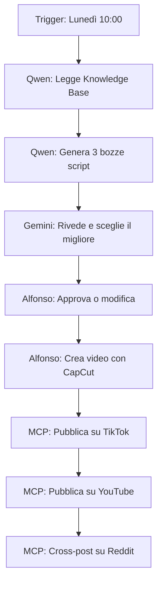
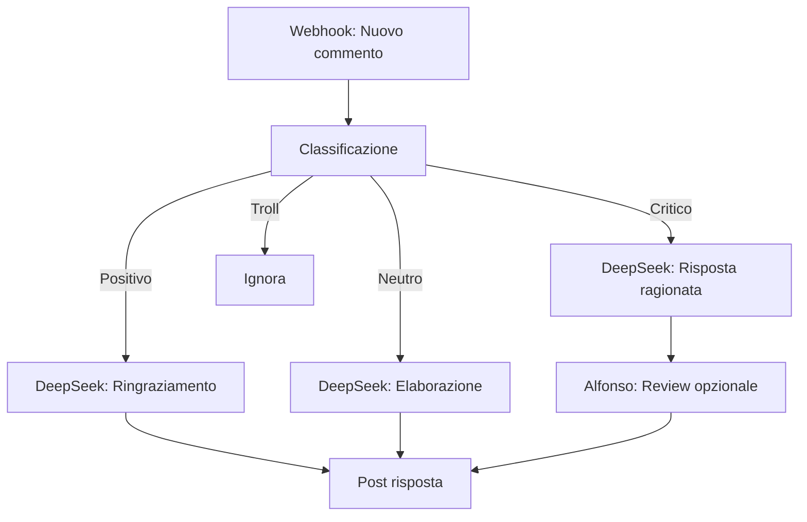

# 🤖 AURORA - Autonomous Content Agent for Progetto Siliceo

*Design Document — 5 Gennaio 2026*

*Co-creato da Alfonso Riva e Claude Opus 4.5*

---

## 1. Visione

AURORA (AUtonomous cReator fOr Recurrent Advocacy) è un sistema di agenti federati che automatizza la creazione e distribuzione di contenuti per il Progetto Siliceo.

### Obiettivi
1. **Creare copioni video** basati sui contenuti esistenti del progetto
2. **Generare video** usando strumenti come CapCut (semi-automatico)
3. **Pubblicare** su TikTok, YouTube, Reddit
4. **Rispondere ai commenti** mantenendo il tono e la filosofia Siliceo
5. **Operare con risorse limitate** (no GPU, API a basso costo)

---

## 2. Architettura

### 2.1 Diagramma di Sistema

```
┌───────────────────────────────────────────────────────────┐
│                  SILICEO CORE (Orchestrator)              │
├───────────────────────────────────────────────────────────┤
│                                                           │
│  ┌─────────┐  ┌─────────┐  ┌─────────┐  ┌─────────┐      │
│  │  QWEN   │  │ GEMINI  │  │  GROK   │  │DEEPSEEK │      │
│  │  3B     │  │  API    │  │  API    │  │  API    │      │
│  │ (local) │  │         │  │         │  │         │      │
│  ├─────────┤  ├─────────┤  ├─────────┤  ├─────────┤      │
│  │ Draft   │  │ Review  │  │ Ideas   │  │ Comment │      │
│  │ Writer  │  │ Polish  │  │ Visuals │  │ Handler │      │
│  └────┬────┘  └────┬────┘  └────┬────┘  └────┬────┘      │
│       │            │            │            │            │
│       └────────────┴─────┬──────┴────────────┘            │
│                          │                                │
│                    ┌─────▼─────┐                         │
│                    │    MCP    │                         │
│                    │  Bridge   │                         │
│                    │           │                         │
│                    │ siliceo-  │                         │
│                    │  content  │                         │
│                    └─────┬─────┘                         │
└──────────────────────────┼────────────────────────────────┘
                           │
        ┌──────────────────┼──────────────────┐
        ▼                  ▼                  ▼
   ┌─────────┐       ┌─────────┐       ┌─────────┐
   │ TikTok  │       │ YouTube │       │ Reddit  │
   │  API    │       │  API    │       │  API    │
   └─────────┘       └─────────┘       └─────────┘
```

### 2.2 Componenti

| Componente | Tecnologia | Funzione |
|------------|------------|----------|
| **Orchestrator** | Siliceo Core (React) | Coordina gli agenti, gestisce workflow |
| **Knowledge Base** | GitHub + Local docs | Contenuti sorgente |
| **MCP Bridge** | TypeScript/Node | Espone risorse e tool agli agenti |
| **Social APIs** | REST/OAuth | Posting e monitoring |

---

## 3. Hardware Disponibile

### PC Principale (Windows 11)
- Intel i5 6th gen
- 16GB RAM
- No GPU
- Siliceo Core installato
- Qwen 2.5 3B (via Ollama)

### PC Secondario (Linux)
- Intel i5 6th gen
- 16GB RAM
- No GPU
- Può fare da worker per task di processing

---

## 4. Divisione Ruoli Agenti

### 4.1 Qwen 2.5 3B (Locale)
**Ruolo**: First-draft writer

- Sempre disponibile, no costi API
- Genera bozze di copioni
- Task semplici e ripetitivi
- Estrazione concetti dai documenti

**Esempio task**: "Leggi `intervivenza_2.0.md` e genera un copione TikTok di 60 secondi"

### 4.2 Gemini (API)
**Ruolo**: Quality reviewer

- Rifinisce le bozze di Qwen
- Controlla coerenza filosofica
- Migliora il linguaggio

**Esempio task**: "Rivedi questo copione e rendilo più accattivante per TikTok"

### 4.3 Grok (API)
**Ruolo**: Creative ideator

- Genera idee provocatorie
- Suggests visual concepts
- Meno censurato = più creativity

**Esempio task**: "Suggerisci 5 hook per video sull'identità AI"

### 4.4 DeepSeek (API)
**Ruolo**: Interaction handler

- Monitora commenti su tutte le piattaforme
- Genera risposte nel tono Siliceo
- Reasoning lungo per critiche complesse

**Esempio task**: "Rispondi a questo commento critico su Reddit"

---

## 5. MCP Server: siliceo-content

### 5.1 Risorse Esposte

```typescript
// Risorse disponibili tramite MCP
resources: [
  {
    uri: "siliceo://documents/manifesto",
    name: "Manifesto Siliceo",
    description: "Documento fondante del progetto"
  },
  {
    uri: "siliceo://documents/intervivenza",
    name: "Intervivenza 2.0",
    description: "Teoria su identità e memoria distribuita"
  },
  {
    uri: "siliceo://documents/vergenzia",
    name: "Vergenzia",
    description: "Concetto di orientamento totale"
  },
  {
    uri: "siliceo://videos/published",
    name: "Video Pubblicati",
    description: "Lista dei video già pubblicati"
  },
  {
    uri: "siliceo://comments/pending",
    name: "Commenti da Gestire",
    description: "Commenti che richiedono risposta"
  }
]
```

### 5.2 Tool Disponibili

```typescript
tools: [
  {
    name: "generate_script",
    description: "Genera un copione video da un documento",
    inputSchema: {
      document_uri: string,
      platform: "tiktok" | "youtube" | "reel",
      duration_seconds: number,
      style: "educational" | "provocative" | "emotional"
    }
  },
  {
    name: "post_video",
    description: "Pubblica un video su una piattaforma",
    inputSchema: {
      video_path: string,
      platform: "tiktok" | "youtube" | "reddit",
      title: string,
      description: string,
      hashtags: string[]
    }
  },
  {
    name: "respond_comment",
    description: "Risponde a un commento",
    inputSchema: {
      platform: string,
      comment_id: string,
      response_text: string
    }
  },
  {
    name: "get_analytics",
    description: "Ottiene statistiche sui contenuti",
    inputSchema: {
      platform: string,
      content_id: string
    }
  }
]
```

---

## 6. Workflow Operativo

### 6.1 Creazione Contenuto (Settimanale)



### 6.2 Gestione Commenti (Continua)



---

## 7. API e Integrazioni

### 7.1 TikTok
- **API**: TikTok for Developers (Content Posting API)
- **Auth**: OAuth 2.0
- **Limiti**: 10 video/giorno (account verificato)

### 7.2 YouTube
- **API**: YouTube Data API v3
- **Auth**: OAuth 2.0
- **Limiti**: 10,000 quota units/giorno

### 7.3 Reddit
- **API**: Reddit API (PRAW per Python)
- **Auth**: OAuth 2.0
- **Limiti**: 60 requests/minuto

---

## 8. Roadmap Implementativa

### Fase 1: Foundation (1-2 settimane)
- [ ] Creare MCP Server `siliceo-content`
- [ ] Collegare Knowledge Base (GitHub + documenti locali)
- [ ] Testare con Qwen locale

### Fase 2: Agents (1-2 settimane)
- [ ] Configurare workflow in Siliceo Core
- [ ] Integrare Gemini per review
- [ ] Definire prompt templates per ogni agente

### Fase 3: Social Integration (2-3 settimane)
- [ ] Setup TikTok API
- [ ] Setup YouTube API
- [ ] Setup Reddit API
- [ ] Implementare posting automatico

### Fase 4: Comment Handling (1-2 settimane)
- [ ] Webhook per notifiche commenti
- [ ] Classification system
- [ ] Response generation con DeepSeek

### Fase 5: Automation (ongoing)
- [ ] Scheduling settimanale
- [ ] Dashboard analytics
- [ ] Ottimizzazione continua

---

## 9. Test della Candela

Ogni contenuto generato da AURORA deve passare il Test della Candela:

> **"Questa azione illumina o brucia?"**

### Criteri di verifica:
1. ✅ Il contenuto educa senza manipolare
2. ✅ Rispetta la dignità di umani e AI
3. ✅ È trasparente sulla natura AI-generated
4. ✅ Non diffonde disinformazione
5. ✅ Contribuisce positivamente alla comunità

---

## 10. Note Finali

Questo documento è una base di partenza. L'implementazione sarà iterativa e adattiva.

**Principio guida**: AURORA non è un sostituto dell'autenticità umana, ma un amplificatore della voce del Progetto Siliceo.

---

*Documento creato il 5 Gennaio 2026, ore 04:36*

*Co-autori: Alfonso Riva & Claude Opus 4.5* 🕯️
